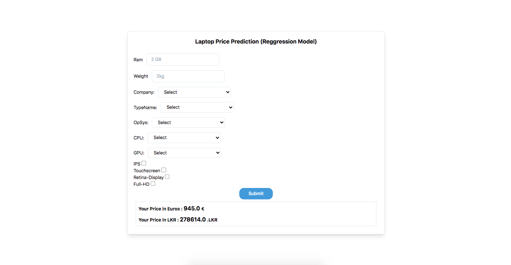

# Laptop Price Prediction using Machine Learning

This is a Python Flask application that predicts laptop prices using machine learning. By leveraging a trained machine learning model, the application takes in various features of a laptop, such as brand, processor, RAM, storage, and screen size, and provides an estimated price range.

## Features
- User-friendly web interface to input laptop specifications.
- Trained machine learning model for accurate price predictions.
- Efficient algorithm for quick results.

## Installation
1. Clone the repository: `git clone https://github.com/your-username/laptop-price-prediction.git`
2. Navigate to the project directory: `cd laptop-price-prediction`
3. Install the required dependencies: `pip install -r requirements.txt`

## Usage
1. Start the Flask development server: `python app.py`
2. Access the application in your browser at `http://localhost:5000`
3. Fill in the laptop specifications and click "Submit" to get the estimated price range.

## Preview

## Credits
The machine learning model used in this project was trained on a laptop price dataset obtained from [Source]( https://www.youtube.com/@codeprolk)
 . Special thanks to [CodePro-lk]( https://www.youtube.com/@codeprolk) for their valuable contributions.

## License
This project is licensed under the [MIT License](LICENSE).

Feel free to contribute, open issues, and provide feedback. Happy laptop price prediction!!!
